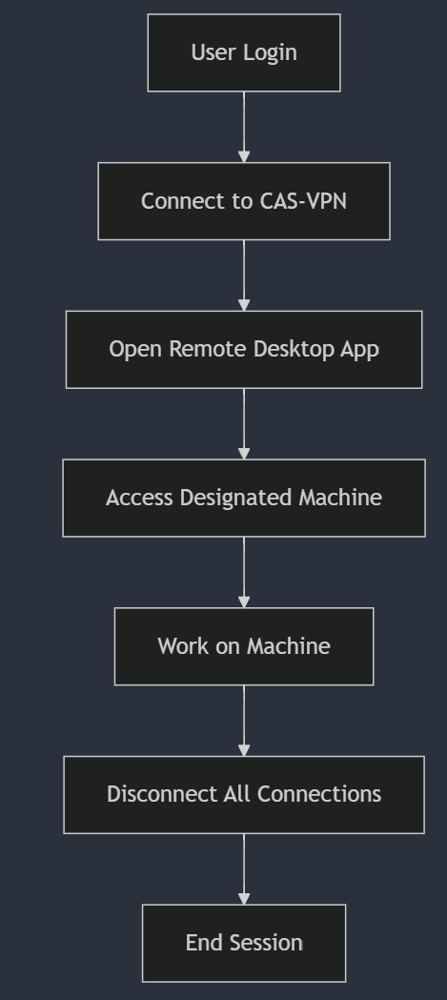

# VPN Automation for Remote Users

## Description
To automate the VPN connections as a requirement for remote users accessing virtual machines via Microsoft Hyper-V, the following processes need to be established:

### Network Setup
A network has been configured to host virtual machines accessible remotely.

### VPN Configuration
VPN connections, labeled as CAS-VPN, have been set up to ensure secure access for remote users.

### Authentication
A RADIUS server is utilized for authenticating domain users, eliminating the need for additional configurations in this area.

### Successful Connections
VPN connections are functioning correctly.

## User Workflow

### Login Process
1. Connect to the CAS-VPN.
2. Use the Remote Desktop app to access the designated machine.

### Logout Process
Users should be able to disconnect all connections from the server, including the VPN.

## Automation Requirement
Create a batch file or utilize software that can automate the steps above. The batch file may invoke PowerShell or other utilities to execute the necessary commands.

### Machine Path
`[Machine Name].casgroup.casbusiness.com`

### User Login Format
- `[Username]@casgroup.casbusiness.com`
- `casgroup\[Username]`

### VPN Flowchart

## Author
- [Harry Joseph](https://github.com/hjoseph777)

### Date
- October 05, 2024